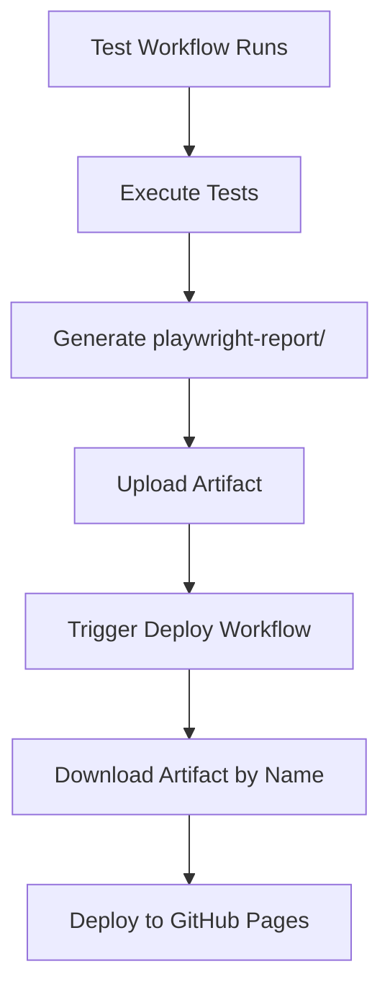

# GitHub Actions Workflow Synchronization

## Overview

This document verifies that all test workflows are properly synchronized with the deployment workflow.

## Deploy Workflow Configuration

**File**: `.github/workflows/deploy-reports.yml`

**Triggers on**:

```yaml
workflow_run:
  workflows: ['Sanity Tests', 'Regression Tests']
  types:
    - completed
```

**Expected Artifact Naming Pattern**:

- Sanity: `sanity-playwright-report-{run_number}`
- Regression: `regression-playwright-report-{run_number}`

## Test Workflows

### ✅ Sanity Tests Workflow

**File**: `.github/workflows/sanity.yml`

- **Workflow Name**: `Sanity Tests` ✓ Matches deploy trigger
- **Artifact Name**: `sanity-playwright-report-${{ github.run_number }}` ✓ Matches expected pattern
- **Upload Location**: `sanity-tests` job (line 104)
- **Upload Condition**: `if: always()` ✓ Ensures upload even on failure
- **Retention**: 3 days
- **Path**: `playwright-report/`

**Status**: 🟢 SYNCHRONIZED

### ✅ Regression Tests Workflow

**File**: `.github/workflows/nightly-regression.yml`

- **Workflow Name**: `Regression Tests` ✓ Matches deploy trigger
- **Artifact Name**: `regression-playwright-report-${{ github.run_number }}` ✓ Matches expected pattern
- **Upload Location**: `regression-tests` job (line 104)
- **Upload Condition**: `if: always()` ✓ Ensures upload even on failure
- **Retention**: 7 days
- **Path**: `playwright-report/`

**Status**: 🟢 SYNCHRONIZED

## Verification Checklist

- [x] Workflow names match deploy workflow trigger configuration
- [x] Artifact naming follows consistent pattern: `{type}-playwright-report-{run_number}`
- [x] Artifacts uploaded directly from test jobs (no intermediate jobs)
- [x] Upload uses `if: always()` to ensure execution even on test failures
- [x] Deploy workflow correctly parses workflow names to construct artifact names
- [x] All workflows use same `@v4` version of `actions/upload-artifact`

## Deployment Flow



## Key Implementation Details

### Test Workflows

- Tests run and generate reports in the same job
- Artifacts uploaded immediately after test execution
- `if: always()` ensures upload happens even if tests fail
- Artifact naming includes `github.run_number` for uniqueness

### Deploy Workflow

- Triggered automatically on test workflow completion
- Detects workflow name from `github.event.workflow_run.name`
- Constructs artifact name based on workflow name pattern matching
- Downloads and deploys to GitHub Pages

## Troubleshooting

If deployment fails to find artifacts:

1. Check test workflow uploaded artifact successfully
2. Verify artifact name matches pattern in deploy workflow
3. Ensure workflow name matches trigger configuration
4. Check artifact hasn't expired (retention days)
5. Review deploy workflow debug output for artifact resolution

## Last Verified

- Date: October 1, 2025
- All workflows: ✅ SYNCHRONIZED
- Status: 🟢 OPERATIONAL
