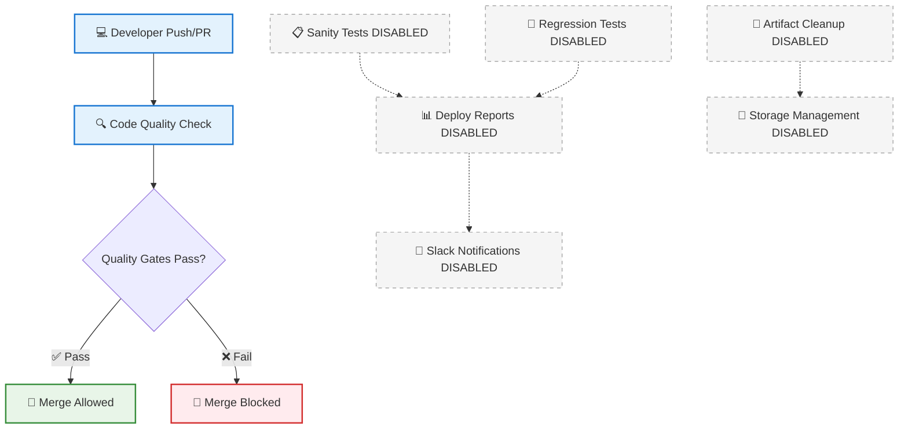

# CI/CD Workflow Diagram

> 🚀 **Visual Representation** of the ITCB-Testing Playwright TypeScript Framework Pipeline

## 🎯 Overview

This diagram illustrates the current CI/CD pipeline architecture for the ITCB-Testing framework, showing both active quality gates and disabled testing workflows ready for future activation.

## 🏗️ Workflow Architecture Diagram



## 📋 Workflow Components

### ✅ Active Pipeline (Currently Running)

| **Component**          | **Status** | **Purpose**                             | **Execution Time** |
| ---------------------- | ---------- | --------------------------------------- | ------------------ |
| **Developer Push/PR**  | 🟢 Active  | Initiates workflow on code changes      | Instant            |
| **Code Quality Check** | 🟢 Active  | ESLint, Prettier, TypeScript validation | ~2-5 minutes       |
| **Quality Gates**      | 🟢 Active  | Pass/fail decision point                | Instant            |
| **Merge Control**      | 🟢 Active  | Allows/blocks merge based on quality    | Instant            |

### 🔒 Disabled Components (Ready for Activation)

| **Component**           | **Status**  | **Purpose**                            | **Estimated Time** |
| ----------------------- | ----------- | -------------------------------------- | ------------------ |
| **Sanity Tests**        | 🔒 Disabled | Critical functionality tests (@sanity) | ~5-10 minutes      |
| **Regression Tests**    | 🔒 Disabled | Comprehensive validation (@regression) | ~30-45 minutes     |
| **Deploy Reports**      | 🔒 Disabled | GitHub Pages test result publishing    | ~2-3 minutes       |
| **Slack Notifications** | 🔒 Disabled | Team communication for test results    | ~30 seconds        |
| **Artifact Cleanup**    | 🔒 Disabled | Automated storage management           | ~1-2 minutes       |
| **Storage Management**  | 🔒 Disabled | Efficient artifact retention policies  | ~1 minute          |

## 🎨 Visual Legend

### Color Coding

- **🔵 Blue (Active)**: Currently implemented and running workflows
- **🟢 Green (Success)**: Successful completion states and merge approval
- **🔴 Red (Failure)**: Error states and merge blocking
- **⚪ Gray (Dashed)**: Disabled features awaiting activation

### Connection Types

- **Solid Lines (→)**: Active workflow connections
- **Dashed Lines (-.->)**: Disabled workflow connections
- **Decision Diamond**: Conditional logic points

## 🚀 Current Pipeline Flow

```
ACTIVE FLOW:
Developer Push/PR → Code Quality Check → Quality Gates Decision → Merge Allowed/Blocked

DISABLED FLOW (Future):
Sanity Tests → Deploy Reports → Slack Notifications
Regression Tests → Deploy Reports → Slack Notifications
Artifact Cleanup → Storage Management
```

## 🛠️ Enabling Disabled Workflows

To activate any grayed-out (disabled) workflow components:

### **Step 1: Remove Workflow Disable Conditions**

```bash
# Navigate to .github/workflows/
# Edit disabled_*.yml files
# Change: if: false  # Workflow disabled
# To:     if: true   # Workflow enabled
```

### **Step 2: Configure Required Secrets**

```bash
# Repository Settings → Secrets and variables → Actions
BASE_URL=https://your-itcb-testing-app.com    # Required for test workflows
SLACK_WEBHOOK_URL=https://hooks.slack.com/... # Optional for notifications
```

### **Step 3: Test Activation**

```bash
1. Go to Actions tab in GitHub
2. Select the newly enabled workflow
3. Click "Run workflow" to test manually
4. Monitor execution and verify integration
```

## 🎯 ITCB-Testing Framework Integration

### **Test Classification Support**

- **@sanity**: Quick critical tests aligned with ITCB-Testing patterns
- **@regression**: Comprehensive validation using Page Object Model
- **Fixture Integration**: Automated page object injection via testSetup.ts

### **Quality Gates Alignment**

- **ESLint**: Validates ITCB-Testing coding standards
- **Prettier**: Enforces consistent formatting across page objects
- **TypeScript**: Ensures type safety for locators and fixtures

### **Architecture Compatibility**

- **Three-Layer Architecture**: Core → Page → Test layer validation
- **Centralized Locators**: Validates UPPER_SNAKE_CASE locator patterns
- **Environment Variables**: Integrates with envUtils.ts patterns

## 📊 Current State Summary

| **Status**      | **Component Count** | **Execution Time**            | **Storage Impact**                |
| --------------- | ------------------- | ----------------------------- | --------------------------------- |
| ✅ **Active**   | 4 components        | ~2-5 minutes                  | Minimal (failure artifacts only)  |
| 🔒 **Disabled** | 6 components        | ~40-60 minutes (when enabled) | Moderate (configurable retention) |

## 🔧 Troubleshooting Diagram Display

If this Mermaid diagram doesn't render in your markdown viewer:

### **Supported Viewers**

1. **GitHub/GitLab**: Native support - should work automatically
2. **VS Code**: Install "Markdown Preview Mermaid Support" extension
3. **Online Preview**: Copy diagram code to [mermaid.live](https://mermaid.live/)
4. **Export Options**: Use mermaid-cli or online tools for PNG/SVG export

### **Quick Test**

```bash
# Copy the mermaid code (between backticks) to:
https://mermaid.live/
# This will validate syntax and show rendered diagram
```

## 🔗 Related ITCB-Testing Documentation

- **🏗️ Copilot Instructions**: [.github/copilot-instructions.md](../.github/copilot-instructions.md)
- **🧪 Test Structure**: Page Object Model with fixture injection
- **🎯 Test Commands**: `npm run test:sanity`, `npm run test:regression`
- **🔧 Quality Commands**: `npm run check`, `npm run fix`

---

**💙 Built for ITCB-Testing Quality-First Development**

🔍 **Current State**: Code Quality Gates Active  
🚀 **Future Ready**: Full CI/CD Pipeline Available for Activation  
🎯 **Framework Aligned**: Supports Page Object Model and Fixture Patterns

**View Live Pipeline**: [ITCB-Testing Actions](../../actions)
